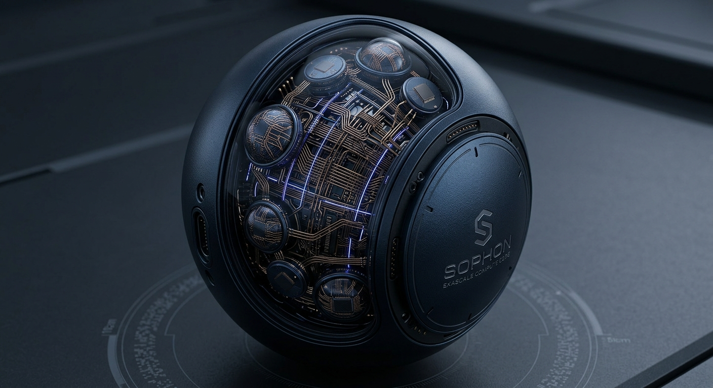

<p align="center">
  
</p>

<h1 align="center">sophon</h1>

<p align="center">
  Local LLM chat, fine-tuning, and a Textual TUI.<br>
  Named after a <b>sophon</b> from <i>The Three-Body Problem</i> -<br>
  a proton unfolded into a higher-dimensional computer.
</p>

<p align="center">
  
  
  
  
</p>

---

Long-term direction (harness, editor, dashboard, swarms, self-evolution): [docs/VISION.md](docs/VISION.md). Public stub: [wagnerp4.github.io/sophon](https://wagnerp4.github.io/sophon/).

## Requirements

- **Python** 3.10+ ([pyproject.toml](pyproject.toml))
- **Pillow**, **Torch**, **Torchvision**, **Transformers**, **accelerate**, **bitsandbytes** as declared in [pyproject.toml](pyproject.toml)
- Hugging Face access for gated checkpoints ([HF_TOKEN](https://huggingface.co/docs/hub/security-tokens) or [hf auth login](https://huggingface.co/docs/huggingface_hub/guides/cli))
- Enough **disk / RAM / GPU** for the checkpoint and quantization mode you pick

---

## Setup

Edit in **WSL**. Run the Textual TUI from **Windows** (Store PowerShell + Windows Terminal). Those are two trees:

| Tree | Path | Role |
| --- | --- | --- |
| WSL checkout | `/home/philipp/software/python/Signal Processing/NLP/Personal/sophon` | git, Cursor, Linux `.venv/bin/sophon-cli` |
| Windows deploy | `C:\Software\Python\NLP\Personal\sophon` (`SOPHON_WINDOWS_ROOT`) | GPU TUI, `.venv\Scripts\sophon-cli.exe` |

Do not run `uv sync` from both sides on the same folder. WSL `uv sync` writes POSIX `.venv`. Windows `uv sync` writes PE `.exe` files.

### WSL (code) then Windows (TUI)

From the WSL checkout:

```bash
uv sync --extra tui --extra finetune
sophon-cli deploy-windows
```

That rsyncs source onto `C:\Software\Python\NLP\Personal\sophon` (keeps Windows `.venv` and `models`), writes the Windows Terminal **sophon** profile (Store `pwsh.exe` + `scripts\start-sophon-chat.ps1 -Foreground`), and runs `uv sync` on Windows if `sophon-chat-tui.exe` is missing.

Open the **sophon** profile in Windows Terminal, or:

```bash
sophon-cli chat --windows --preset llama2_7b_chat
```

Override the deploy path with `SOPHON_WINDOWS_ROOT`. Profile-only:

```bash
sophon-cli tui-profiles install
sophon-cli deploy-windows --profile-only
```

From **Store PowerShell** on the deploy tree:

```powershell
cd C:\Software\Python\NLP\Personal\sophon
.\scripts\deploy-windows.ps1
.\.venv\Scripts\sophon-cli.exe chat --preset llama2_7b_chat
```

Optional Unsloth backend: add `--extra finetune-unsloth` to `uv sync`.

### Omarchy / Arch (single tree)

On a Linux host with no Windows deploy tree, keep one checkout. Do not set `SOPHON_WINDOWS_ROOT`.

```bash
uv sync --extra tui --extra finetune
cp .env.example .env
sophon-cli chat --no-spawn-window --preset llama2_7b_chat
```

Headless / SSH:

```bash
sophon-cli chat --interface repl --preset llama2_7b_chat
```

Optional: open the same command in kitty or wezterm. Native desktop spawn tries those terminals when they are on PATH. If none are present, use `--no-spawn-window`.

LM Studio / Ollama on localhost work the same as on WSL. GPU Hugging Face weights need a CUDA-capable `uv` venv on this machine. Do not `uv sync` a Windows PE venv into this tree.

### WSL-only (no Windows TUI)

```bash
uv sync --extra tui --extra finetune
sophon-cli chat --linux --preset llama2_7b_chat
```

### Troubleshooting: Windows Terminal 0x8007010b

`error 2147942667 (0x8007010b) ... Could not access starting directory "C:\Software\Python\NLP\Personal\sophon"` means the Windows Terminal **sophon** profile still points at a folder that was deleted. The Textual app is not the failure. Recreate the deploy tree from WSL:

```bash
cd "/home/philipp/software/python/Signal Processing/NLP/Personal/sophon"
uv sync --extra tui --extra finetune
./scripts/deploy-windows.sh --sync-venv
```

Then open the **sophon** profile, or:

```powershell
cd C:\Software\Python\NLP\Personal\sophon
.\scripts\start-sophon-chat.ps1 -Foreground
```

If the folder exists but the profile is stale: `./scripts/deploy-windows.sh --profile-only`.

---

## Run

```bash
sophon-cli chat
sophon-cli chat --windows
sophon-cli chat --preset gemma4_12b_it
sophon-cli chat --interface repl
sophon-cli chat --interface toad
sophon-cli finetune --preset llama2_7b_chat --dataset gsm8k_instructions
sophon-cli finetune --recipe config/finetune/qa-chain.yaml
```

### Chat backends

Startup resolves `SOPHON_CHAT_BACKEND` (default `auto`):

1. **Ollama** if `OLLAMA_HOST` responds and at least one model is listed
2. else **LM Studio** if OpenAI-compatible `/v1/models` responds and at least one model is listed
3. else **Hugging Face** presets / local weights

`/models` (TUI: overlay picker, also `Ctrl+M`) always lists **all** sources. Selecting an entry switches backend automatically (`ollama:…`, `lmstudio:…`, or HF preset). `/backend` is optional.

In chat: `/backend`, `/models`, `/model NAME`. Server backends need no Hub download.

```bash
SOPHON_CHAT_BACKEND=auto
OLLAMA_HOST=http://127.0.0.1:11434
SOPHON_LM_STUDIO_HOST=http://127.0.0.1:1234/v1
```

### TTS

Default speech backend is **Pipecat Kokoro** (local ONNX). Install extras:

```powershell
# close sophon-cli / TUI first if Windows locks Scripts\*.exe
uv sync --extra tui --extra tts
```

```bash
SOPHON_TTS_BACKEND=pipecat
SOPHON_TTS_SPEAKER=am_adam
SOPHON_TTS_TOOL=1
```

Chat: `/speak TEXT`, `/tts on|off`, `/tts-backend pipecat|hf-qwen-custom-voice|ollama`. Spoken turns are stored per session. Replay with `/play [last|user|assistant|N] [1x|1.5x|2x]` or the TUI clip row. List with `/clips`. Files live in `data/chat_audio/<session_id>/` (or `~/.cache/sophon/chat_audio` on WSL `/mnt/c` checkouts).

Generation knobs: `/params`, `/temp`, `/top-p`, `/max`, `/seed`, `/rep`. `/max` is the per-reply token budget. LM Studio tool-loop rounds default to unlimited (`/tool-rounds N`, `/unlimited`).

### SST (press to talk)

Microphone capture is **start/stop**, not a timed listen.

| Surface | Start | Stop |
| --- | --- | --- |
| **TUI** | **Speak** next to the prompt, or `Ctrl+L` | **Stop** / `Ctrl+L` / empty Enter. Esc cancels |
| **REPL** | `/listen` | Enter or `/listen` again. `/listen cancel` discards |

```powershell
uv sync --extra tui --extra sst
```

```text
SOPHON_SST=1
SOPHON_SST_MAX_S=120
SOPHON_SST_MIC=
```

`SOPHON_SST_MAX_S` is a safety cap only. Empty ASR output is not inserted into the prompt.

### Obsidian + Zotero

With Obsidian **Local REST API** running, sophon exposes read-only vault tools to LM Studio chat (`vault_search`, `vault_list`, `vault_read`, `vault_recent`):

```text
SOPHON_OBSIDIAN_TOOLS=1
SOPHON_OBSIDIAN_API_URL=https://127.0.0.1:27124
SOPHON_OBSIDIAN_API_KEY=paste-from-plugin
```

One-shot in **PowerShell** (current session only):

```powershell
$env:SOPHON_OBSIDIAN_TOOLS = "1"
$env:SOPHON_OBSIDIAN_API_URL = "https://127.0.0.1:27124"
$env:SOPHON_OBSIDIAN_API_KEY = "paste-from-plugin"
```

Check with `/obsidian-status`. In the editor, View → Vault tree or View → Zotero tree (or `Ctrl+Shift+T`) shows those libraries in the project pane. View → Disk trees expands readable volume roots without changing the terminal cwd. LM Studio chat can call `zotero_tree` / `zotero_search` / `zotero_list` / `zotero_read` / `zotero_metrics` when the library is reachable (`/zotero-status`, `/zotero-search QUERY`).

See [docs/integrations/obsidian](docs/integrations/obsidian/README.md) and [docs/integrations/zotero](docs/integrations/zotero/README.md).
