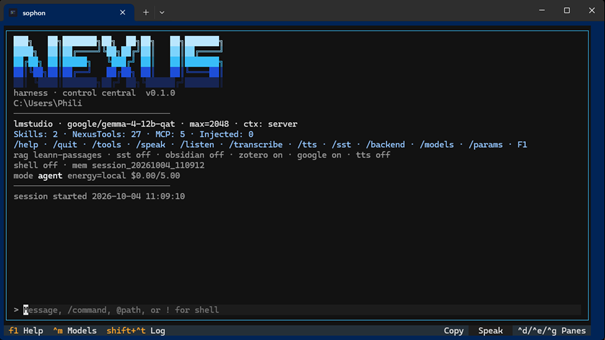
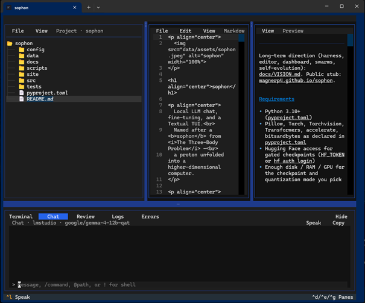

<p align="center">
  
</p>

<h1 align="center">sophon</h1>

<p align="center">
  Local LLM chat, fine-tuning, and a Textual TUI.<br>
  Named after a <b>sophon</b> from <i>The Three-Body Problem</i> -
  a proton unfolded into a higher-dimensional computer.
</p>

<p align="center">
  
  
  
  
</p>

<table>
  <tr>
    <td width="50%"></td>
    <td width="50%"></td>
  </tr>
  <tr>
    <td align="center"><sub>Nexus chat: harness, NexusTools, MCP</sub></td>
    <td align="center"><sub>Editor: project tree, code, preview, chat dock</sub></td>
  </tr>
</table>

Long-term direction (harness, editor, dashboard, swarms, self-evolution): [docs/VISION.md](docs/VISION.md). Public stub: [wagnerp4.github.io/sophon](https://wagnerp4.github.io/sophon/).

## Requirements

- **Python** 3.10+, dependencies per [pyproject.toml](pyproject.toml) (Torch, Transformers, accelerate, bitsandbytes, Pillow)
- Hugging Face access for gated checkpoints ([HF_TOKEN](https://huggingface.co/docs/hub/security-tokens) or [hf auth login](https://huggingface.co/docs/huggingface_hub/guides/cli))
- Enough **disk / RAM / GPU** for the checkpoint and quantization you pick

## Quick start

```bash
uv sync --extra tui --extra finetune
cp .env.example .env
sophon-cli chat                     # single tree (Linux / Arch)
sophon-cli deploy-windows           # WSL checkout -> Windows deploy tree + Terminal profile
```

Editing in WSL and running the TUI on Windows uses two trees. See [docs/reference/install.md](docs/reference/install.md) for the layout, Omarchy/Arch, WSL-only, troubleshooting, and TTS/SST details.

## Run

```bash
sophon-cli chat [--windows] [--preset gemma4_12b_it] [--interface repl|toad]
sophon-cli finetune --preset llama2_7b_chat --dataset gsm8k_instructions
sophon-cli finetune --recipe config/finetune/qa-chain.yaml
```

**Backends.** `SOPHON_CHAT_BACKEND=auto` picks Ollama (`OLLAMA_HOST`), then LM Studio (`SOPHON_LM_STUDIO_HOST`), then Hugging Face presets. `/models` (`Ctrl+M`) lists all sources and switches backend on selection.

**Generation.** `/params`, `/temp`, `/top-p`, `/max`, `/seed`, `/rep`. Tool-loop rounds default to unlimited (`/tool-rounds N`).

## Features

| Area | What | Toggle / commands |
| --- | --- | --- |
| TTS | Pipecat Kokoro (local ONNX), replay per session | `uv sync --extra tts`, `/speak`, `/tts on\|off`, `/play`, `/clips` |
| SST | Press-to-talk mic capture | `uv sync --extra sst`, TUI **Speak** / `Ctrl+L`, REPL `/listen` |
| Obsidian | Read-only vault tools via Local REST API | `SOPHON_OBSIDIAN_TOOLS=1`, `/obsidian-status` |
| Zotero | Library tree, search, read, metrics | on when reachable, `/zotero-status` |
| arXiv | `arxiv_search`, `arxiv_get_paper` for local models | `SOPHON_ARXIV_TOOLS` (default on), `/arxiv-status` |
| Shell | Workspace shell with Landlock/bwrap sandbox | `SOPHON_SHELL_TOOLS=1`, `/sandbox full\|workspace-write\|read-only` |
| VM sandbox | `shell_exec` inside a disposable QEMU Ubuntu VM | `/sandbox vm`, `/vm status\|up\|down\|reset\|exec` |
| Harness | Plan / chat / agent modes, allow/ask/deny rules | `/mode`, `/permissions`, `.sophon/harness.yaml` |

Environment reference: [docs/reference/setup.md](docs/reference/setup.md). Integrations: [obsidian](docs/integrations/obsidian/README.md), [zotero](docs/integrations/zotero/README.md), [search](docs/integrations/search/README.md), [mcp](docs/integrations/mcp/README.md), [github](docs/integrations/github/README.md).
