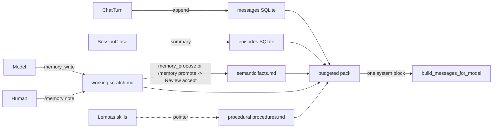

# Memory layer

## Role

Memory is state with policy, not "more context". The layer gives chat and agents durable, budgeted recall across sessions without poisoning context or leaking secrets. It composes five tiers, injects a budgeted pack into each turn, and only promotes durable facts through the human Review flow.

On by default (`data/memory/memory.db`, or `~/.cache/sophon/memory/memory.db` when the repo is on a Windows mount from WSL). Override with `SOPHON_MEMORY_DB` or `--memory-db`. Set `SOPHON_MEMORY_DB=0` to disable and fall back to trailing-turns recall only.

## Tiers

| Tier | Store | Lifetime | Writer | Trust |
| --- | --- | --- | --- | --- |
| working | `.sophon/memory/scratch/<session>.md` | session | model (`memory_write`), human (`/memory note`) | low |
| episodic | SQLite `episodes` (+ `messages` recall) | days-weeks | system on close / `/memory compact` | medium |
| semantic | `.sophon/memory/facts.md` | until revoked | human via `/memory promote` (Review) | high |
| procedural | `.sophon/memory/procedures.md` | until revoked | human | high |
| retrieved | computed per turn (`MemoryLayer.pack`) | one inference | system | variable |

CoALA ([arXiv:2309.02427](https://arxiv.org/abs/2309.02427)) names working / episodic / semantic / procedural. Retrieved is the per-turn pack. Anthropic's memory tool (`memory_20250818`, [context engineering](https://www.anthropic.com/engineering/effective-context-engineering-for-ai-agents)) is a directory the model views first and edits as files. We mirror the directory shape but stop model writes at scratch.

Confidence tags on every scratch and fact entry: `observed` (saw evidence), `decided` (a choice), `hypothesis` (a guess). Only `observed` and `decided` may be promoted to semantic.

## Flow

## File layout

`.sophon/memory/` (override with `SOPHON_MEMORY_DIR`):

- `scratch/<session>.md` working notes, gitignored
- `facts.md` durable facts, committed
- `procedures.md` skill/recipe pointers, committed
- `MEMORY-STATE.md` catalog, gitignored
- `memory-constraints.md` deny-list doc (`## Deny literals` bullets are extra denied strings)

SQLite (`SOPHON_MEMORY_DB`, schema v2): `messages`, `sessions`, `episodes`, `facts_index`.

## Budget

One system block per turn under `SOPHON_MEMORY_BUDGET_CHARS` (default 4000). Per-tier caps are fractions of the total (facts 35, retrieved 20, scratch 20, procedures 15, episodic 10). Earlier turns also honor `SOPHON_MEMORY_RECALL_TURNS` (default 6). Truncation is reported inline as `(memory: N dropped)`. The budget is enforced in code, never by asking the model.

## Model tools (gated)

`SOPHON_MEMORY_TOOLS=1` (default on when the layer is on, LM Studio backend):

- `memory_view` list tiers and counts (view before long tasks)
- `memory_search` query across tiers
- `memory_read` read one entry by tier and id
- `memory_write` write a scratch note only (optional `tags`)
- `memory_propose` queue a `facts.md` promotion in Review (observed/decided scratch only)

The model cannot write `facts.md` or `procedures.md`. It can ask: write scratch, call `memory_propose`, tell you to Accept or Decline. Deny-list redaction runs on every write.

Default procedure `perror1`: after an error or the same approach twice, note it, propose promotion, do not retry the same failed step without a new hypothesis. Search memory first.

## Slash commands (human)

- `/memory status` tiers, counts, budget, last dropped
- `/memory list <tier>`
- `/memory search <query>`
- `/memory note <text>` scratch note tagged `decided`
- `/memory promote <id...>` queue a `facts.md` edit in the Review tab (Accept / Decline / Undo)
- `/memory revoke <fact-id>` soft-delete a durable fact
- `/memory compact` fold current scratch into one episode, clear scratch
- `/memory-status`, `/memory-clear` retained for the transcript store

## Constraints

- No model write path to `facts.md` or `procedures.md`. Promotion is human, through Review.
- Deny-list before any write. Secrets (`hf_...`, `sk-...`, private keys, `client_secret`, `.env` values) are redacted, never stored.
- Budget enforced in code.
- Paths in facts are project-relative where possible. Tag `root=windows|wsl` when absolute (see [os-and-deploy.md](os-and-deploy.md)).
- `STATE.md` is loop state, not memory ([orchestrator.md](orchestrator.md)).

## Non-goals (until reversed)

- Temporal graph memory (Graphiti/Zep-style validity intervals) beyond `revoked_at`.
- Vector DB as the day-one store. Markdown + SQLite first. LEANN ranking is a later hook in `MemoryLayer.search`.
- Model-driven automatic fact extraction (Mem0-style ingest). Only scratch notes plus human promote.
- Swarm worker memory isolation. That belongs to the orchestrator.

## Source modules

`src/processing/text/memory/`: `tiers.py`, `budget.py`, `markdown_store.py`, `sqlite_memory.py`, `layer.py`, `tools.py`, `factory.py`. Injection in `src/processing/text/context/builder.py` (`render_memory_pack`). Wiring in `src/cli/chat.py`.
