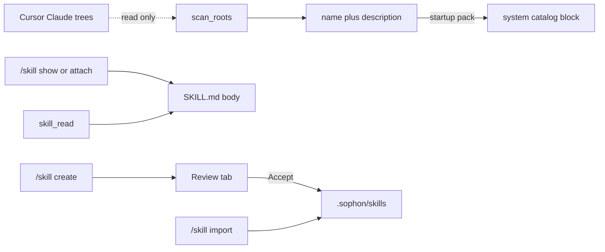

# Skills (Lembas)

## Role

Skills are reusable procedures, not facts. Each skill is a directory with a public [Agent Skills](https://agentskills.io/specification) `SKILL.md` (YAML `name` + `description`, then a markdown body) and optional `scripts/`, `references/`, `assets/`. Sophon parses that file as-is. Cursor-only keys (`disable-model-invocation`) and spec extras (`license`, `compatibility`, `metadata`, `allowed-tools`) are kept on read and ignored when unused.

**Lembas** is the product name. On disk the folder is `skills/` so a downloaded pack drops in without renaming.

On by default. Set `SOPHON_SKILLS=0` to disable the catalog and tools.

## Where to store

**Write (create / import target)**

- Project: `.sophon/skills/<name>/SKILL.md` (commit with the repo)
- User: `~/.sophon/skills/<name>/SKILL.md` (all Sophon projects)

**Read-only extra roots (auto-scan every session, metadata only)**

- `.cursor/skills`, `~/.cursor/skills`
- `.claude/skills`, `~/.claude/skills`
- Skip `~/.cursor/skills-cursor` (Cursor built-ins)

Name clash: project `.sophon` wins, then user `.sophon`, then project `.cursor`, user `.cursor`, project `.claude`, user `.claude`. `/skill list` prints `root=` for the winner and lists shadowed copies.

Override roots with `SOPHON_SKILLS_DIRS` (pathsep-separated) if needed. We scan Claude and Cursor trees. We do not write into them.

## Progressive disclosure

1. **Catalog** - `name` + `description` + `root=`, injected under `SOPHON_SKILLS_CATALOG_CHARS` (default 1500).
2. **Body** - full `SKILL.md` only on `/skill attach`, `/skill show`, or model `skill_read`.
3. **Resources** - `skill_read_file` for `references/` or listed `scripts/` paths. No script execution in v1. Paths are shown. Shell stays the existing gated `shell_*` tools.

Procedural memory stays a pointer list. `procedures.md` has `pskill1`: skills live in `.sophon/skills` and attach via `/skill`.

## Flow

## Slash commands

- `/skill` / `/skill list` / `/skills` - discovered skills, `root=`, winner, shadowed
- `/skill show <name>` - print body (no attach)
- `/skill attach <name>` - inject body for this session until `/skill detach`
- `/skill detach [name]` - drop one attached body, or all if no name
- `/skill create <name> [--user] [description]` - scaffold a spec-valid folder, queue Review
- `/skill import <path> [--user]` - copy a `SKILL.md` directory into `.sophon/skills` (or user), validate frontmatter, Review

`create-skill` is also a bundled skill at `.sophon/skills/create-skill/SKILL.md`. The slash command writes the file. The skill teaches the model how to draft one.

## Model tools (gated)

`SOPHON_SKILL_TOOLS=1` (default on when the catalog is on, LM Studio backend):

- `skill_list` - names + descriptions + `root=`
- `skill_read` - one `SKILL.md` body
- `skill_read_file` - relative path under that skill root only (path jail)

No `skill_write`. Create and import go through Review.

System hint: call `skill_list` before a specialized workflow. `skill_read` before claiming a procedure. Do not invent a skill that is not in the list.

## Constraints

- No model write path to `.sophon/skills` or to Cursor/Claude trees.
- No automatic `scripts/` execution.
- Catalog budget is enforced in code.
- Secrets stay out of skill files (same deny-list idea as memory).

## Non-goals (until reversed)

- Running `scripts/` automatically
- Skill marketplace / GitHub install
- SkillSpector scan (later install gate)
- Eval-before-promote and `lembas/<id>@<rev>` versioning (follow-up in [self-evolution.md](self-evolution.md))
- Writing skills into Cursor or Claude directories

## Source modules

`src/processing/text/skills/`: `spec.py`, `catalog.py`, `store.py`, `tools.py`, `factory.py`. Injection in `src/processing/text/context/builder.py` (`skills_block`). Wiring in `src/cli/chat.py`.
